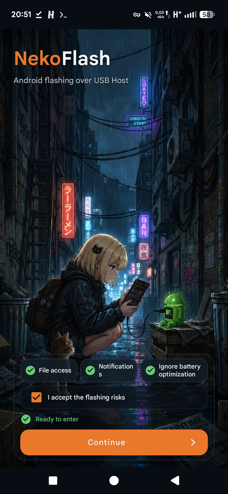
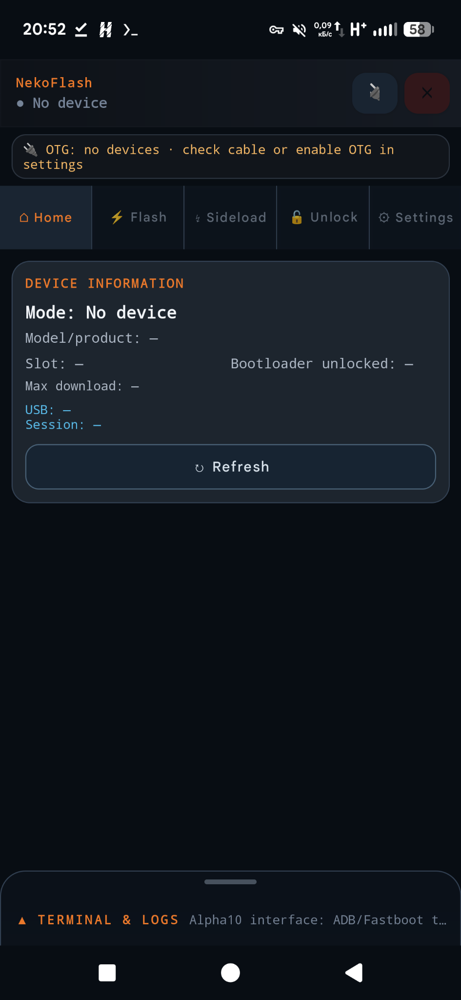
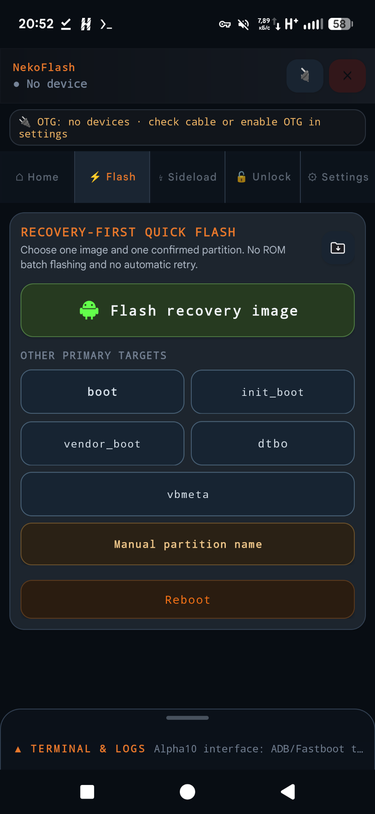
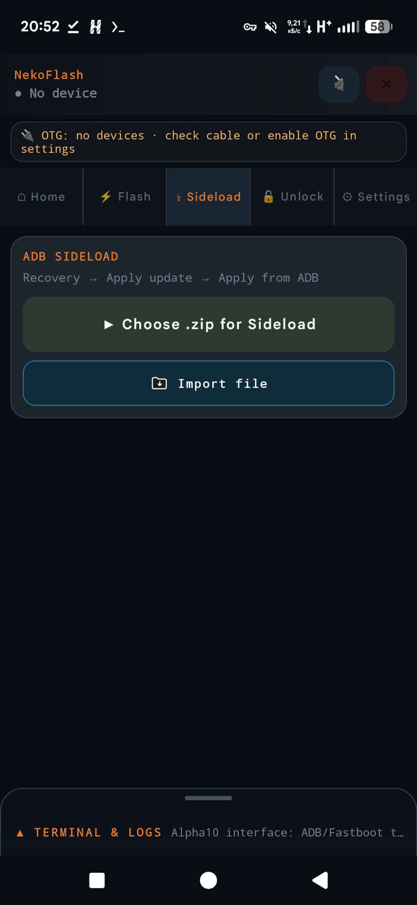
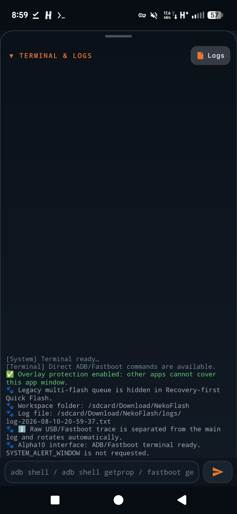
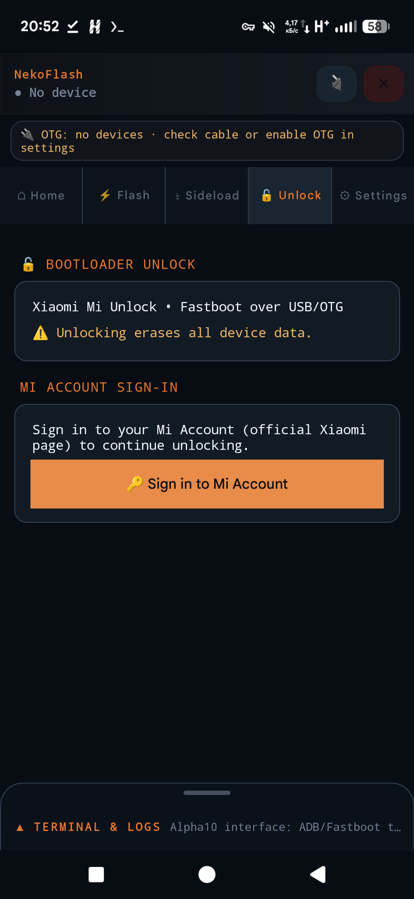

# NekoFlash 2.0 — development checkpoint REV5

> **Статус:** проект в разработке. Это полный Android-исходник оригинального NekoFlash 6.0.0-alpha11 с первым переносом согласованного экрана **Sideload REV3**. Это **не NekoFlash Pro** и **не готовый APK NekoFlash 2.0**. Остальной утверждённый дизайн REV2/REV4 ещё не перенесён в Android-код. Не выполняйте разблокировку без отдельного разрешения владельца устройства.

- [Аудит и дорожная карта REV5](docs/source-audit/NEKOFLASH2-REV5-AUDIT-AND-ROADMAP-RU.md)
- [Утверждённый дизайн и контрольные решения](docs/design-approved/README.md)
- [Детали исходной точки и локальные проверки](docs/source-audit/README-FIRST-RU.md)

**CI:** push и Pull Request проверяют lint + Debug APK; подписанный Release в workflow сборки запускается вручную с настроенными secrets. Выпуск по тегу остаётся отдельным workflow. Отсутствие release-ключей не должно делать первоначальный push красным.

---

## Исходная документация NekoFlash (историческая версия)

# NekoFlash

**NekoFlash** is an Android USB OTG flashing tool for controlling, servicing, and flashing another Android device directly from a phone or tablet — **without a PC** and without root on the host device.

It implements **ADB and Fastboot directly over Android USB Host** and supports recovery/boot image flashing, ADB Sideload, device diagnostics, and Xiaomi Mi Unlock workflows.

### What you can do

- Connect **Android-to-Android over USB OTG / USB-C**.
- Use **ADB** shell, push/pull, APK installation, reboot commands, and ADB Sideload.
- Use **Fastboot** for diagnostics, partition discovery, flashing, booting, erasing, formatting, slot switching, and supported OEM commands.
- Flash `recovery`, `boot`, `init_boot`, `vendor_boot`, `dtbo`, `vbmeta`, or another selected partition with **Quick Flash**.
- Flash compatible custom recovery images such as **TWRP** directly from an Android phone.
- Perform supported **Xiaomi Mi Unlock** workflows using Fastboot over USB.
- Work without desktop `adb`, desktop `fastboot`, or a Windows/Linux/macOS computer.

> [!WARNING]
> Flashing, erasing, formatting, changing slots, or unlocking a bootloader can cause data loss or make a device unbootable. Always verify the target device, image, partition, and slot before writing.


<!-- NEKOFLASH_DOWNLOAD_START -->
## Download

Latest release: **v6.0.0-alpha11**

[](https://github.com/Ncorror/NekoFlash/releases/download/v6.0.0-alpha11/NekoFlash-6.0.0-alpha11.apk)

- [NekoFlash v6.0.0-alpha11 APK](https://github.com/Ncorror/NekoFlash/releases/download/v6.0.0-alpha11/NekoFlash-6.0.0-alpha11.apk)
- [APK SHA-256](https://github.com/Ncorror/NekoFlash/releases/download/v6.0.0-alpha11/NekoFlash-6.0.0-alpha11.apk.sha256)

The APK is distributed through GitHub Releases assets, not GitHub Packages. Official release assets also include signing and build metadata.
<!-- NEKOFLASH_DOWNLOAD_END -->
## Installation

1. Download the latest NekoFlash APK from the **Download** section above.
2. Optionally verify the APK with the published SHA-256 checksum.
3. Allow your browser or file manager to install apps from unknown sources when Android asks.
4. Install NekoFlash on the Android phone or tablet that will act as the USB host.
5. Connect the target Android device using a data-capable USB OTG / USB-C cable.
6. Select the required mode in NekoFlash: **ADB**, **Recovery / ADB Sideload**, or **Fastboot**.

No PC is required for the documented USB flashing workflows.

## Screenshots

| Welcome | Device / Home | Quick Flash |
|---|---|---|
|  |  |  |

| ADB Sideload | Terminal & Logs | Xiaomi Mi Unlock |
|---|---|---|
|  |  |  |

<!-- NEKOFLASH_USB_NOTE_START -->
## USB-C / ADB connection note

When using a direct USB-C to USB-C cable, Android may sometimes negotiate the wrong USB data role or USB power role.

Expected connection:

- the phone running NekoFlash acts as the USB host;
- the phone running NekoFlash provides bus power;
- the target/patient phone appears as the connected USB device;
- power flows from the NekoFlash host phone to the target/patient phone.

Incorrect USB role:

- the NekoFlash host phone shows that it is charging from the target/patient device;
- the target/patient device behaves as the USB host;
- an unexpected device appears first;
- normal Android ADB `DEVICE` mode does not attach to the intended target.

If this happens, unplug and reconnect the cable, swap cable ends, rotate the USB-C connector, or try another data-capable USB-C cable until the intended target device is detected.

Do not start flash, sideload or shell operations while the detected device is not the intended target.

This issue is documented for normal Android ADB `DEVICE` mode. Fastboot and Recovery/SIDELOAD are separate modes and remain covered by their own validation tests.
<!-- NEKOFLASH_USB_NOTE_END -->
<!-- NEKOFLASH_LEGAL_SUMMARY_START -->
## License and independence

NekoFlash is licensed under the Apache License 2.0.

NekoFlash is an independent project and is not affiliated with or endorsed by Google, Xiaomi, MiForge, Termux or any referenced open-source project.

NekoFlash does not require Termux, desktop adb/fastboot, MiFlash, MiForge, Google Play Services or vendor cloud services for the documented USB workflows. Android platform APIs, build tools and declared open-source dependencies remain under their own licenses.

See also:

- [USB connection troubleshooting](docs/USB_CONNECTION_TROUBLESHOOTING.md)
- [Legal review](docs/LEGAL_REVIEW.md)
- [Third-party notices](THIRD_PARTY_NOTICES.md)
<!-- NEKOFLASH_LEGAL_SUMMARY_END -->

NekoFlash is an Android USB Host utility for working with a second Android device directly from a phone or tablet. The host connects over USB OTG (including Type-C to Type-C), uses Android USB Host APIs, and does not require root on the host.

**Current source version:** `6.0.0-alpha11` (`versionCode 234`). The published GitHub release is `v6.0.0-alpha11`.

## Features

- **ADB:** discovery/authentication, shell, push, pull, APK install, reboot services and ADB Sideload.
- **Fastboot:** diagnostics, `getvar`, partition inventory, `flash`, `boot`, `erase`, `format`, `set_active`, OEM/flashing commands and raw Fastboot commands supported by the connected bootloader.
- **Quick Flash:** direct image flashing to `recovery`, `boot`, `init_boot`, `vendor_boot`, `dtbo`, `vbmeta` or a manually entered partition. Slotted partitions can target the current slot or all reported slots.
- **Mi Unlock:** Xiaomi account/unlock flow using official Xiaomi HTTPS endpoints and Fastboot over USB.
- **Diagnostics:** compact logs, protocol traces, session summaries and sanitized sharing/export helpers.
- **Operation Center:** persistent Home task surface with a large current action, percentage/indeterminate progress, `step X of Y`, nearby queue steps, result details, reports access and explicit cancellation. Cancellation has its own safe-cleanup state instead of freezing the last flashing percentage.
- **Live operation strip:** compact non-blocking progress/status strip above every workflow page while work is active; it keeps both the current step and the safety/status message visible, and tapping it opens and scrolls directly to the full Operation Center. Successful/cancelled results clear automatically after a short confirmation window, while failed/verify-pending results stay visible until reviewed or dismissed. Stale progress from an earlier heavy operation is suppressed during later lightweight diagnostics/commands.
- **Console:** persistent compact terminal/log dock that never auto-expands for operations; it opens only on explicit user action and exposes command history while expanded.

NekoFlash does not bundle desktop `adb` or `fastboot` executables. ADB/Fastboot protocol traffic is implemented inside the app and sent through the Android USB Host transport.

## Requirements and safety

- Android 8.0 / API 26 or newer on the host device;
- USB Host / OTG support;
- a data-capable USB cable or OTG adapter;
- a target device in ADB, Recovery/ADB Sideload or Fastboot mode;
- ADB authorization when requested by the target;
- firmware/images that are correct for the target device.

Flashing, erasing, formatting, slot changes and bootloader unlocking can cause data loss or leave a device unable to boot. Verify the device, partition, slot and file before every write operation.

NekoFlash serializes long USB operations so only one operation owns the active endpoint at a time. It does not automatically retry ambiguous mid-stream Fastboot DATA writes because the peer may already have consumed an unknown prefix of the payload.

## Runtime architecture

```text
Android UI / MainActivity
        |
        v
DeviceViewModel / single operation owner
        |
        +--> AdbProtocol --------------------> Android USB Host
        |
        +--> FastbootProtocol ---> NativeUsbfsBackend (JNI/C++ usbfs)
                              \--> UsbRequest / bulk-transfer fallback
```

`DeviceViewModel` owns the active USB session, foreground/wake-lock lifecycle and progress publication. `AdbProtocol` implements ADB authentication, packet dispatch, shell, Sync transfers, install and `sideload-host`. `FastbootProtocol` implements command/response handling, partition/slot discovery and real DATA/mutation operations.

Native USBFS is the high-throughput Fastboot DATA backend. It uses bounded URB pipelining and explicit ownership rules. If the backend cannot prove that all submitted URBs have returned from the kernel, the backend is treated as poisoned and is not reused in the same process.

## Build

Current toolchain:

| Component | Version / value |
|---|---|
| JDK | 17 |
| Gradle Wrapper | 8.13 |
| Android Gradle Plugin | 8.13.2 |
| Kotlin | 2.3.21 |
| compileSdk | 36 |
| targetSdk | 34 |
| minSdk | 26 |

Debug build:

```bash
chmod +x gradlew
./gradlew --no-daemon --warning-mode all :app:lintDebug :app:assembleDebug
```

Or package the debug APK under `forum-build/`:

```bash
bash scripts/build-apk.sh debug
```

### Signed release build

Production release APKs must be signed with the permanent NekoFlash release key. Define:

```bash
export NEKOFLASH_RELEASE_STORE_FILE=/absolute/path/to/nekoflash-release.jks
export NEKOFLASH_RELEASE_STORE_PASSWORD='...'
export NEKOFLASH_RELEASE_KEY_ALIAS='...'
export NEKOFLASH_RELEASE_KEY_PASSWORD='...'
```

Then run:

```bash
bash scripts/build-apk.sh release
```

The release helper verifies the keystore certificate, runs release lint/build checks, verifies the produced APK with `apksigner`, and writes the APK plus its SHA-256 checksum to `forum-build/`.

Pinned release certificate SHA-256:

```text
b122576dcaa5b1ceebd977545314bd515432f9e3fa50733fa8153a1e48a6c19e
```

Unsigned production APKs are not official release artifacts.

## GitHub Actions and release flow

`.github/workflows/build.yml` is the source-of-truth build check for reviewed commits. `.github/workflows/release.yml` is tag-driven and requires the pushed tag to match `v${versionName}`. It builds the signed APK, verifies the signing certificate, generates the APK checksum and publishes the GitHub Release.

Required repository secrets:

```text
NEKOFLASH_KEYSTORE_BASE64
NEKOFLASH_STORE_PASSWORD
NEKOFLASH_KEY_ALIAS
NEKOFLASH_KEY_PASSWORD
```

Before tagging a release candidate:

1. merge the reviewed PR into protected `main`;
2. obtain green GitHub Actions for the exact merged commit;
3. perform the required physical USB hardware smoke on that exact source/build;
4. verify the release version and signing identity;
5. create and push the annotated tag matching `versionName`.

The published `v6.0.0-alpha10.2` release corresponds to `versionName` `6.0.0-alpha10.2` and `versionCode 233`. Do not recreate or retag an existing release.

For the **next** tag-driven release, bump `versionName` / `versionCode` first, validate the exact merged commit, and then create a tag that exactly matches `v${versionName}` as required by `release.yml`.

Physical-device evidence retained by the project is indexed in [docs/HARDWARE_VALIDATION.md](docs/HARDWARE_VALIDATION.md), with device-specific reports for:

- [POCO X7 Pro (`rodin`)](docs/evidence/POCO_X7_PRO_ALPHA10.md);
- [POCO X3 Pro (`vayu`)](docs/evidence/POCO_X3_PRO_ALPHA10_1.md).

## Termux-only maintainer workflow

Initial setup:

```bash
bash scripts/termux-bootstrap.sh
gh auth login
gh auth setup-git
```

Start from current `main`:

```bash
cd "$HOME/NekoFlash"
git switch main
git pull --ff-only origin main
git status --short
```

Publish reviewed local changes through a short-lived PR branch:

```bash
bash scripts/termux-publish.sh "docs: prepare release"
```

Import a reviewed source ZIP first when needed:

```bash
bash scripts/termux-publish.sh \
  --source-zip "$HOME/storage/downloads/NekoFlash-source.zip" \
  --sha256 "EXPECTED_ZIP_SHA256" \
  "chore: import reviewed source"
```

Watch and merge the PR only after required checks are green:

```bash
gh pr checks --repo Ncorror/NekoFlash --watch PR_URL
gh pr merge --repo Ncorror/NekoFlash --merge --delete-branch PR_URL
```

Run or collect GitHub Actions evidence:

```bash
bash scripts/termux-ci.sh
bash scripts/termux-ci.sh --run-id RUN_ID
bash scripts/termux-ci.sh --run-id RUN_ID --with-apk
```

Do not force-push protected `main` and do not commit build outputs, local signing material, account secrets, raw device identifiers or unsanitized diagnostic logs.

## Privacy and network access

ADB, Fastboot, flashing, sideload and diagnostics operate locally between the host Android device and the USB-connected target. The source tree contains no analytics, advertising or third-party crash-reporting SDK.

Internet/network access is used by the optional Xiaomi / Mi Unlock flow. See [PRIVACY.md](PRIVACY.md) for the data-handling details.

## Documentation

The public documentation is intentionally small:

- [CHANGELOG.md](CHANGELOG.md) — release-level history;
- [docs/UI_UX_AUDIT.md](docs/UI_UX_AUDIT.md) — current UI/UX, localization and non-blocking Console audit;
- [docs/HARDWARE_VALIDATION.md](docs/HARDWARE_VALIDATION.md) — retained physical-device evidence and release hardware boundary;
- [PRIVACY.md](PRIVACY.md) — privacy/network behavior;
- [THIRD_PARTY_NOTICES.md](THIRD_PARTY_NOTICES.md) — bundled dependencies, attribution and non-bundled reference acknowledgements;
- [ASSETS_LICENSE.md](ASSETS_LICENSE.md) — branded artwork licensing.

Implementation detail that changes with the code belongs in source comments and Git history rather than in parallel planning/state documents.

## License and project identity

Source code, documentation, build scripts and ordinary UI resources are licensed under Apache License 2.0 unless a file or notice states otherwise. See [LICENSE](LICENSE) and [NOTICE](NOTICE).

The launcher and welcome-screen artwork listed in [ASSETS_LICENSE.md](ASSETS_LICENSE.md) are excluded from the Apache-2.0 grant.

NekoFlash is an independent project and is not affiliated with or endorsed by Google, Xiaomi, MiForge, Termux or the referenced open-source projects. Product names and trademarks belong to their respective owners.
